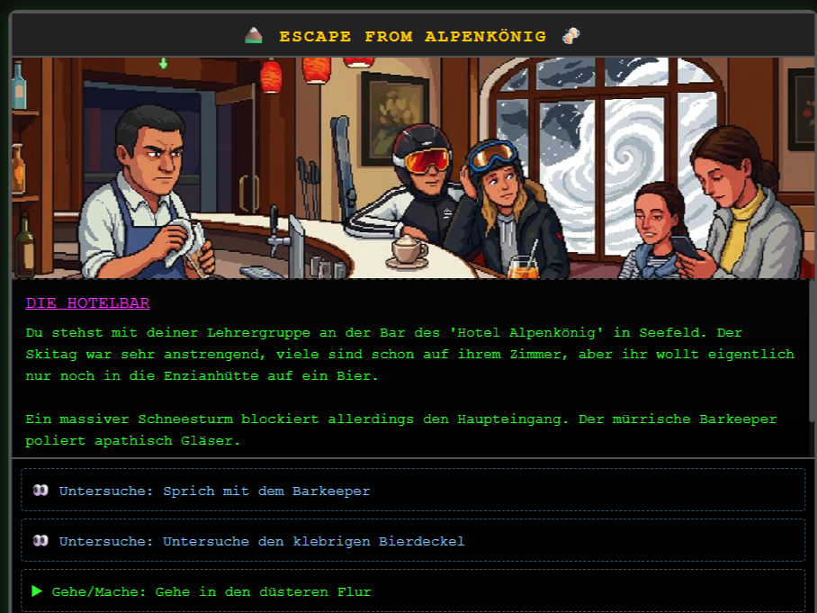
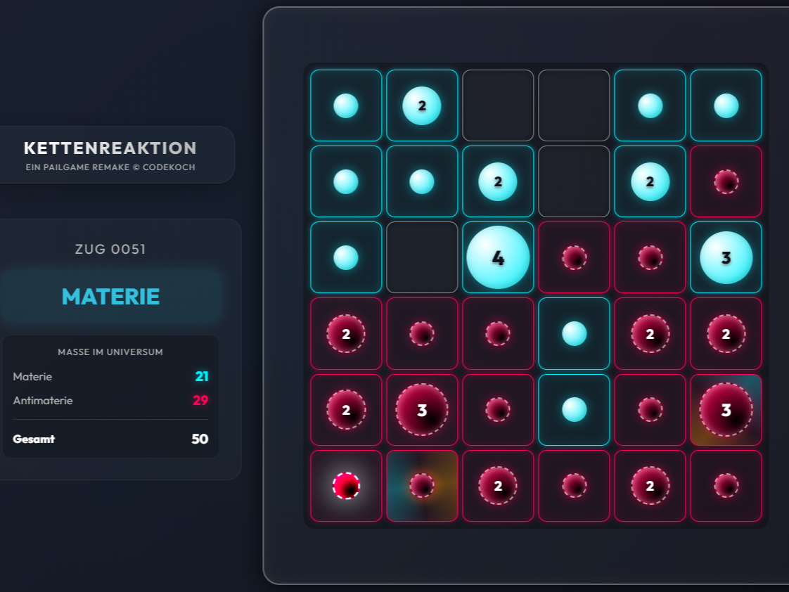
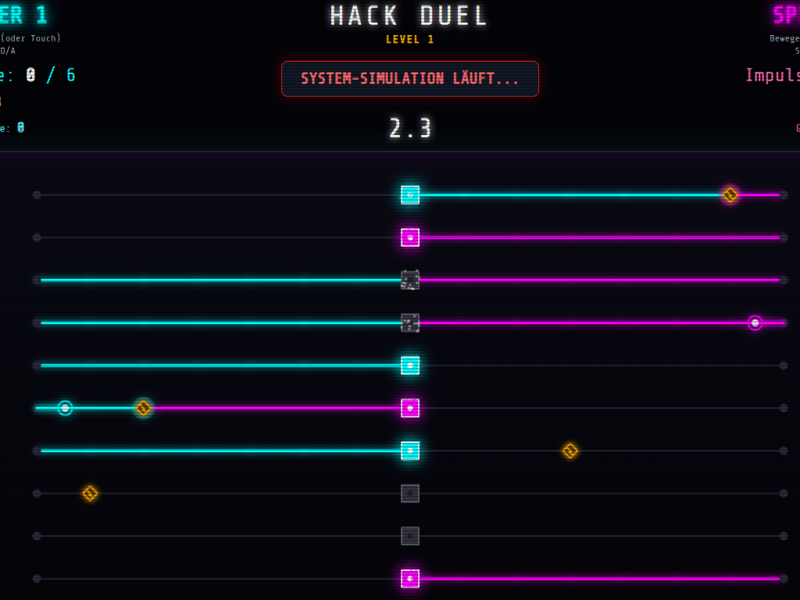
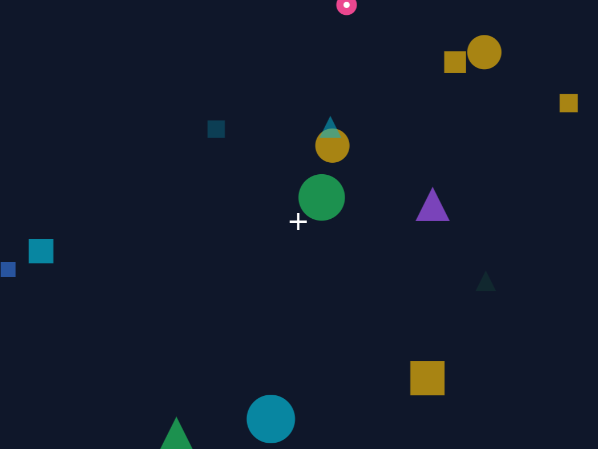

# games by codekoch
<table>
  <tr>
    <td align="center">
      <a href="https://codekoch.github.io/SchulHacks/escapefromalpenkoenig.html">
         
        <b>Escape from Alpenkönig</b>
      </a>
    </td>
    <td align="center">
      <a href="https://codekoch.github.io/Kettenreaktion">
         
        <b>Kettenreaktion</b>
      </a>
    </td>    
    <td align="center">
      <a href="https://codekoch.github.io/hackduel">
         
        <b>Hack Duel</b>
      </a>
    </td>
     <td align="center">
      <a href="https://codekoch.github.io/SchulHacks/FokusTraining.html">
         
        <b>Fokus Training</b>
      </a>
    </td>
  </tr>
</table>
